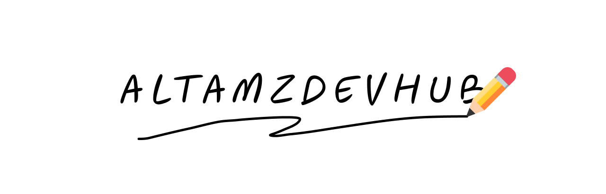

# 💫 About Me:
I’m a self-taught front-end web developer. I’m currently learning HTML, CSS, and JavaScript. In the future, I will move on to a JavaScript and css framework, which is a powerful tool for building websites.

## 🌐 Socials:
  

# 💻 Tech Stack:
   
# 📊 GitHub Stats:
 
 

---

<!-- Proudly created with GPRM ( https://gprm.itsvg.in ) -->
